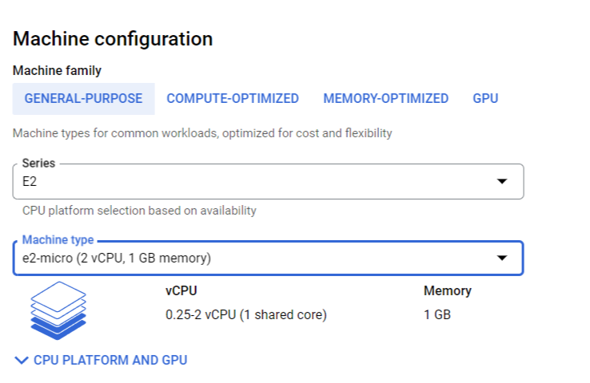
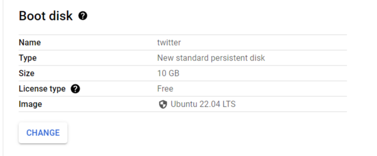
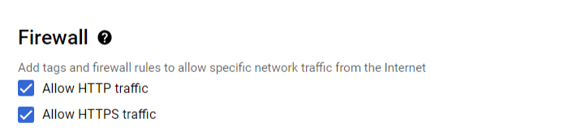

# Notion-Twitter-Automation
 
## Description - 
This project fetches tweets that are to be posted on a particular date from your notion database and posts them on Twitter on that day at different specified times. This project uses node.js, python and google cloud VM to get the job done. The database looks like the picture below and the tweets are posted when the current date matches the date mentioned in the date column.


## Tools used - 
1. Node.js to query the database and retrieve the tweets for the day
2. Python to post the tweets on Twitter

## Let's go ahead and launch the project🥳-

Note - Get the Notion database key and Twitter API keys. Enter them in the notion_data_fetch.js and script.py respectively.

1. Log into your GCP account and create the following VM - 




2. SSH into the VM. Enter the following command to update the OS -
```
sudo apt-get update
```
3. Python comes preinstalled with this Ubuntu Version, we need to install pip so that we can install python libraries. Enter the following command - 
```
sudo apt-get install python3-pip
```
4. Now we need to install node.js for our javascript file to work. Enter the following commands - 
```
sudo apt install nodejs
sudo apt install npm
```
5. Let's install the python library needed - 
```
sudo pip3 install tweepy
```
6. Let's install the node.js library needed - 
```
npm install @notionhq/client
```
7. Now we need to set the time of the VM in order for it to run at the correct time. I am setting IST using the following command - 
```
sudo timedatectl set-timezone Asia/Kolkata
```
8. Now we need to create a cronjob in crontab for our program to run at particular time mentioned in the script.py file. Enter the following command - 
```
crontab -e
```
9. Go to at the last line of the crontab file and enter the following - 
```
55 9 * * * node /home/ksgcpcloud/notion_data_fetch.js
0 10 * * * python3 /home/ksgcpcloud/script.py
0 14 * * * python3 /home/ksgcpcloud/script.py
0 18 * * * python3 /home/ksgcpcloud/script.py
```
10. Exit the Vim editor to save and install the crontab
11. Close the SSH window.
12. Now we need to schedule the VM so that it restarts each day to fetch the fresh tweets everyday.
13. Using the Instance Schedule option, schedule the VM to shut down at 9:00 am and start at 9:30am.
14. Voila!!! Your automation is UP and running. Congrats✌️
