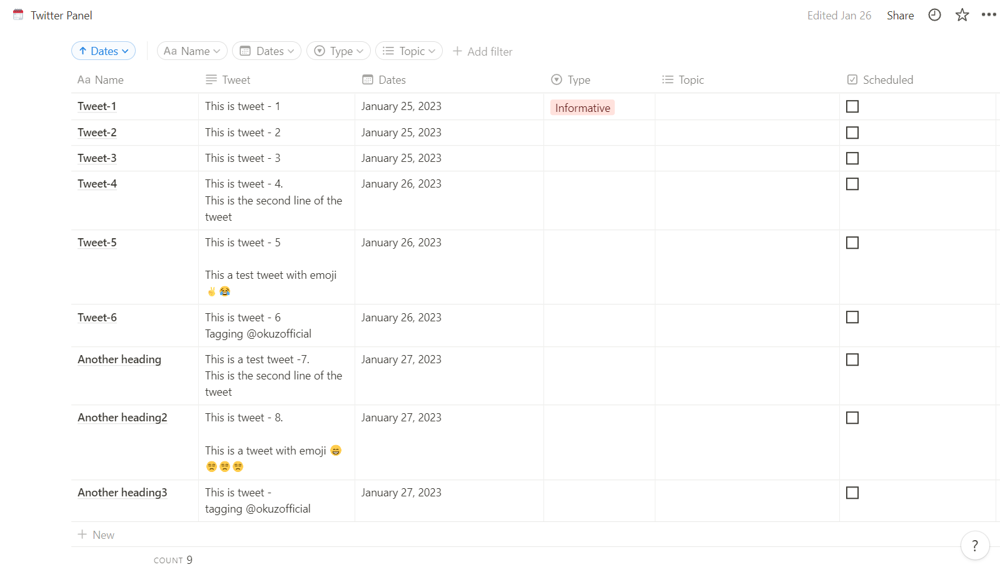

# Notion-Twitter-Automation
 
## Description - 
This project fetches tweets that are to be posted on a particular date from your notion database and posts them on Twitter on that day at different specified times. This project uses node.js, python and google cloud VM to get the job done. The database looks like the picture below and the tweets are posted when the current date matches the date mentioned in the date column.

